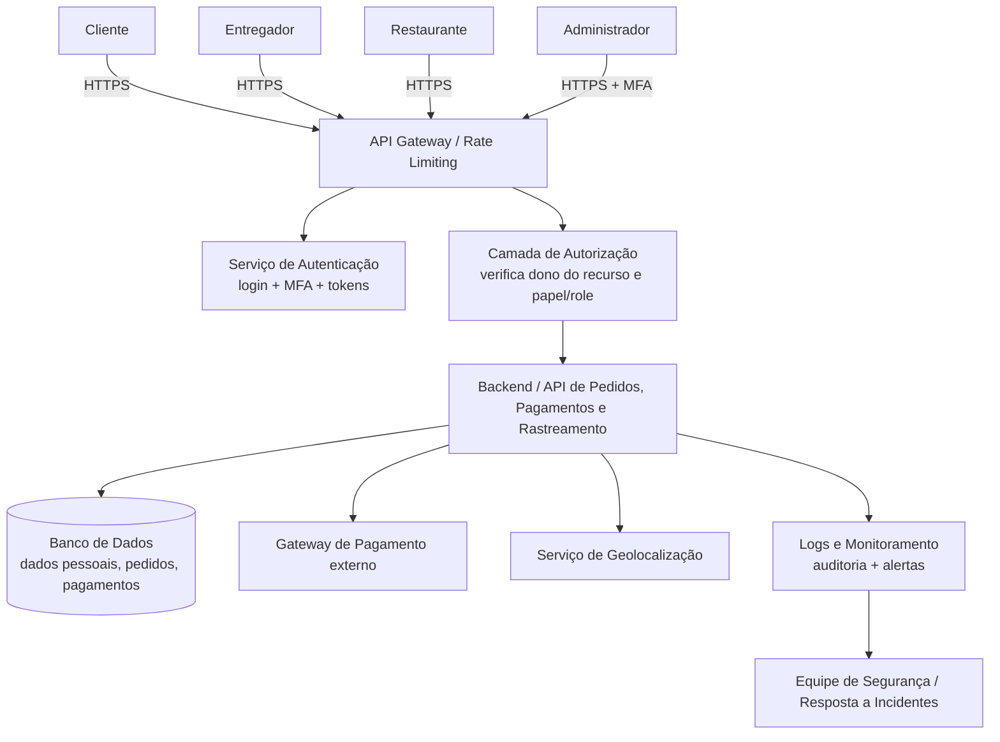

# Trabalho de Engenharia de Software Seguro - Aplicativo Delivery Go.

## 1. Identificação do Sistema

- **Nome do Sistema:** Delivery Go
- **Integrantes:** Fabiano Mion, Emanuel Irion
- **Repositório:** https://github.com/fabianomion/trabalho-es-seguro.git
- **Justificativa:** Para a escolha do sistema: o sistema foi escolhido por envolver múltiplos perfis de usuários com interesses e níveis de acesso distintos (clientes, restaurantes/lojistas e entregadores), grande volume de dados sensíveis (dados pessoais, localização em tempo real e pagamentos) e diversas operações críticas de segurança (autenticação, transações financeiras, avaliações e comunicação entre as partes). Essa combinação de fatores permite identificar uma ampla variedade de ameaças e casos de abuso realistas, tornando o sistema um bom objeto de estudo para a disciplina.

---

## 8.2 Descrição do sistema

O DeliveryGo é uma plataforma digital (aplicativo móvel e painel web) que conecta três tipos de usuários: **clientes**, que desejam comprar produtos (principalmente refeições) de estabelecimentos parceiros; **restaurantes/lojistas**, que cadastram seus cardápios e recebem pedidos; e **entregadores**, que retiram os pedidos nos estabelecimentos e os entregam aos clientes.

**Problema que o sistema resolve:** facilita a compra e entrega de refeições e outros produtos, eliminando a necessidade de o cliente se deslocar até o estabelecimento e permitindo que pequenos negócios ampliem seu alcance sem precisar manter uma frota própria de entrega.

**Quem utiliza o sistema:**
- Clientes finais (consumidores);
- Estabelecimentos parceiros (restaurantes, mercados, farmácias etc.);
- Entregadores parceiros (motoboys, ciclistas);
- Administradores da plataforma (suporte, financeiro, operações).

**Principais funcionalidades:**
- Cadastro e login de usuários (cliente, restaurante, entregador);
- Busca e navegação por restaurantes e cardápios;
- Criação, acompanhamento e cancelamento de pedidos;
- Pagamento on-line (cartão, PIX, carteira digital) ou na entrega;
- Atribuição de pedidos a entregadores e rastreamento de entrega em tempo real;
- Avaliação de restaurantes, produtos e entregadores;
- Chat/mensagens entre cliente, restaurante e entregador;
- Painel administrativo para gestão de pedidos, disputas e estornos.

**Informações armazenadas ou transmitidas:**
- Dados pessoais (nome, CPF, endereço, telefone, e-mail);
- Credenciais de acesso (senha ou token de autenticação);
- Dados de pagamento (número de cartão tokenizado, histórico de transações);
- Localização em tempo real (cliente e entregador durante a entrega);
- Histórico de pedidos e avaliações;
- Mensagens trocadas entre as partes.

**Recursos que precisam ser protegidos:**
- Contas de usuário (clientes, restaurantes e entregadores);
- Dados pessoais e de localização;
- Transações financeiras e dados de pagamento;
- Integridade dos pedidos (valores, itens, status);
- Disponibilidade do serviço, especialmente em horários de pico;
- Comunicação entre as partes (mensagens e notificações).

---

## 8.3 Usuários, ativos e pontos de interação

### Usuários e perfis de acesso
| Perfil | Descrição | Nível de acesso |
|---|---|---|
| Cliente | Realiza pedidos e pagamentos | Acesso à própria conta, pedidos e pagamentos |
| Restaurante/Lojista | Gerencia cardápio e recebe pedidos | Acesso ao painel do estabelecimento e aos pedidos recebidos |
| Entregador | Retira e entrega pedidos | Acesso a pedidos atribuídos e rota de entrega |
| Administrador | Suporte e operação da plataforma | Acesso amplo a dados de todos os usuários e transações |

### Ativos importantes identificados
- **Dados pessoais e sensíveis:** nome, CPF, endereço, telefone — expõem os usuários a fraude e engenharia social se vazados;
- **Credenciais de acesso:** senhas e tokens de autenticação — ponto crítico contra acesso indevido a contas;
- **Dados de pagamento:** cartões, carteiras digitais, histórico financeiro — alvo de fraude financeira;
- **Localização em tempo real:** posição do cliente e do entregador — risco à segurança física se exposta indevidamente;
- **Pedidos e seus valores:** integridade essencial para evitar prejuízo financeiro;
- **Avaliações:** ativo de reputação, suscetível a manipulação (avaliações falsas);
- **Mensagens entre usuários:** podem conter dados sensíveis ou ser usadas para golpes;
- **Banco de dados central:** armazena todos os dados acima — ativo crítico de maior impacto se comprometido;
- **APIs de integração:** comunicação entre app móvel, backend, gateway de pagamento e serviços de mapas/geolocalização;
- **Servidores e infraestrutura em nuvem:** hospedam o backend e o banco de dados;
- **Aplicativos móveis (cliente e entregador):** pontos de entrada sujeitos a engenharia reversa e adulteração local.

### Pontos de interação
- App do cliente ↔ Backend (API REST/GraphQL);
- App do entregador ↔ Backend (atualização de localização e status de entrega);
- Painel do restaurante ↔ Backend (gestão de cardápio e pedidos);
- Backend ↔ Gateway de pagamento (processamento de transações);
- Backend ↔ Serviço de geolocalização/mapas (cálculo de rotas e distância);
- Backend ↔ Banco de dados (persistência de todas as informações);
- Backend ↔ Serviço de notificações push/SMS/e-mail.

---

## 8.4 Visão geral da arquitetura ou fluxo

Fluxo simplificado, representado em texto:

1. O **cliente** navega pelo app, escolhe um restaurante e monta o pedido.
2. O app do cliente envia o pedido para o **backend**, via API.
3. O backend valida o pedido e aciona o **gateway de pagamento** para processar o pagamento.
4. Após a confirmação do pagamento, o backend notifica o **restaurante**, que prepara o pedido.
5. O backend seleciona um **entregador** disponível e envia a solicitação de coleta.
6. O entregador retira o pedido no restaurante e o sistema atualiza o status para "em rota", compartilhando a localização em tempo real com o cliente.
7. O entregador entrega o pedido ao cliente, que confirma o recebimento e pode avaliar o restaurante e o entregador.
8. Todas as informações (pedido, pagamento, avaliações, mensagens) são persistidas no **banco de dados central**.

## 8.5 Modelagem de ameaças com STRIDE

| ID | Categoria STRIDE | Componente ou ativo | Ameaça identificada | Possível impacto |
|---|---|---|---|---|
| T01 | Spoofing | Conta do cliente | Atacante utiliza credenciais vazadas (ex.: reuso de senha) para acessar a conta de outro cliente | Acesso a dados pessoais, realização de pedidos fraudulentos usando o método de pagamento da vítima |
| T02 | Spoofing | Conta do entregador | Pessoa não autorizada se passa por um entregador cadastrado para retirar pedidos | Roubo de produtos, exposição do cliente a um agente não verificado |
| T03 | Tampering | Valor do pedido | Interceptação e alteração da requisição de pedido para reduzir o valor cobrado antes do pagamento | Prejuízo financeiro ao restaurante e à plataforma |
| T04 | Tampering | Status de entrega/localização | Entregador ou app adulterado envia localização falsa para simular que está no local | Cobrança indevida de taxas, atraso não detectado, perda de confiança do cliente |
| T05 | Repudiation | Confirmação de entrega | Cliente nega ter recebido o pedido mesmo após confirmação no app, solicitando reembolso indevido | Prejuízo financeiro ao restaurante/entregador, disputas sem evidência suficiente |
| T06 | Repudiation | Ações do administrador | Administrador realiza alteração manual em pedidos ou reembolsos sem registro de auditoria | Dificuldade de rastrear fraudes internas ou abuso de poder |
| T07 | Information Disclosure | Banco de dados de usuários | Falha de autorização expõe dados pessoais e histórico de pedidos de outros usuários | Violação de privacidade, exposição a golpes e assédio |
| T08 | Information Disclosure | Localização em tempo real | API de rastreamento exposta permite que terceiros consultem a localização do cliente ou entregador sem autorização | Risco à segurança física dos usuários |
| T09 | Denial of Service | API/Backend | Ataque de sobrecarga (DDoS) ou abuso de requisições em horário de pico (ex.: sexta à noite) | Indisponibilidade do app, perda de pedidos e receita |
| T10 | Denial of Service | Gateway de pagamento | Envio massivo de tentativas de pagamento inválidas sobrecarrega a integração com o gateway | Impossibilidade de concluir pagamentos legítimos |
| T11 | Elevation of Privilege | Painel administrativo | Exploração de falha de autorização permite que um usuário comum acesse funções administrativas | Acesso e manipulação indevida de dados de todos os usuários e transações |
| T12 | Elevation of Privilege | API de restaurante | Um restaurante mal-intencionado explora falha na API para acessar dados de pedidos de outros restaurantes concorrentes | Vazamento de informações comerciais sensíveis (cardápio, preços, volume de vendas) |

Todas as seis categorias do STRIDE puderam ser aplicadas ao sistema, uma vez que ele possui múltiplos usuários, comunicação em rede, transações financeiras e dados sensíveis, o que caracteriza superfícies de ataque relevantes para cada categoria.

---
## 8.6 Casos de abuso

### CA01 — Conta falsa de entregador para roubo de pedidos
**Ator:** usuário mal-intencionado.

**Objetivo:** obter acesso a pedidos pagos para se apropriar dos produtos sem realizar a entrega.

**Condições:** o sistema permite cadastro de entregadores com verificação de identidade insuficiente (ex.: apenas foto de documento, sem validação cruzada).

**Fluxo de abuso:**
1. O atacante cria uma conta de entregador usando documento falso ou de terceiro.
2. O sistema aprova o cadastro sem validação adicional.
3. O atacante aceita pedidos legítimos atribuídos pela plataforma.
4. O atacante retira o pedido no restaurante e não realiza a entrega, desaparecendo com o produto.

**Impacto:** prejuízo financeiro ao cliente e ao restaurante, dano à reputação da plataforma, possível reincidência com múltiplas vítimas.

**Categorias STRIDE relacionadas:** Spoofing, Elevation of Privilege.

---

### CA02 — Manipulação do valor do pedido antes do pagamento
**Ator:** usuário cliente mal-intencionado com conhecimento técnico.

**Objetivo:** pagar valor menor do que o real pelo pedido.

**Condições:** o backend não revalida o valor do pedido no momento do pagamento, confiando no valor enviado pelo cliente.

**Fluxo de abuso:**
1. O atacante monta um pedido normalmente pelo app.
2. Antes de enviar a requisição de pagamento, intercepta e altera o valor total via proxy/ferramenta de interceptação.
3. O backend aceita o valor alterado sem revalidar contra o cadastro de preços do restaurante.
4. O pedido é processado e entregue com valor pago muito abaixo do real.

**Impacto:** prejuízo financeiro direto ao restaurante e à plataforma; se replicado em escala, pode gerar perdas significativas.

**Categorias STRIDE relacionadas:** Tampering, Elevation of Privilege.

---

### CA03 — Avaliações falsas para manipular reputação
**Ator:** restaurante concorrente ou o próprio dono do estabelecimento usando contas falsas.

**Objetivo:** aumentar artificialmente a nota do próprio estabelecimento ou reduzir a de concorrentes.

**Condições:** o sistema permite avaliações sem exigir vínculo comprovado com um pedido real, ou permite múltiplas contas facilmente.

**Fluxo de abuso:**
1. O atacante cria múltiplas contas falsas ou usa contas de terceiros.
2. Realiza pedidos fictícios de baixo valor (ou usa contas sem pedido real, se o sistema permitir).
3. Publica avaliações positivas para o próprio negócio ou negativas para concorrentes.
4. O sistema exibe as avaliações manipuladas normalmente aos demais usuários.

**Impacto:** distorção da confiança dos clientes, prejuízo à concorrência leal, possível perda de clientes por informações falsas.

**Categorias STRIDE relacionadas:** Repudiation, Information Disclosure (uso de dados de terceiros), Spoofing.

---

### CA04 — Exposição da localização do cliente
**Ator:** atacante externo explorando falha de autorização em API.

**Objetivo:** rastrear a localização de um cliente específico durante a entrega.

**Condições:** a API de rastreamento de entrega não verifica corretamente se quem consulta o endpoint tem permissão sobre aquele pedido específico.

**Fluxo de abuso:**
1. O atacante identifica o endpoint da API responsável por exibir a localização da entrega em andamento.
2. Ao manipular o identificador do pedido na requisição (ex.: incrementar o ID), consegue acessar dados de rastreamento de outros pedidos que não são seus.
3. O atacante obtém a localização em tempo real de clientes que não conhece.

**Impacto:** risco à segurança física dos clientes, violação grave de privacidade, possível uso para crimes como abordagens ou assaltos.

**Categorias STRIDE relacionadas:** Information Disclosure, Elevation of Privilege.

---

### CA05 — Falso reembolso por negação de recebimento
**Ator:** cliente mal-intencionado (usuário legítimo abusando do sistema).

**Objetivo:** obter reembolso ou novo pedido gratuito alegando falsamente não ter recebido a entrega.

**Condições:** o processo de confirmação de entrega não possui evidências suficientes (ex.: apenas toque em "confirmar recebimento", sem foto ou assinatura).

**Fluxo de abuso:**
1. O cliente recebe o pedido normalmente.
2. Mesmo assim, contata o suporte alegando não ter recebido nada.
3. Como não há evidência forte de entrega (foto, geolocalização no momento da entrega), a plataforma opta por reembolsar para evitar desgaste.
4. O cliente repete o comportamento em pedidos futuros.

**Impacto:** prejuízo financeiro recorrente para a plataforma e para os restaurantes/entregadores, incentivo a fraudes similares por outros usuários.

**Categorias STRIDE relacionadas:** Repudiation.

---

# Etapa 2 — Análise, Priorização e Tratamento de Riscos com o NIST CSF

## 13.1 Critérios de probabilidade

| Valor | Classificação | Critério |
|---|---|---|
| 1 | Baixa | Depende de condições incomuns, acesso muito específico ou alta capacidade técnica |
| 2 | Média-baixa | Possível, mas depende de vulnerabilidade ou condição específica |
| 3 | Média-alta | Plausível, pode ocorrer em situações comuns de uso ou ataque |
| 4 | Alta | Pode ocorrer com facilidade, frequência ou em condições previsíveis |

## 13.2 Critérios de impacto

| Valor | Classificação | Critério |
|---|---|---|
| 1 | Baixo | Pequeno transtorno, corrigido rapidamente |
| 2 | Moderado | Interrupção ou inconsistência limitada, recuperável |
| 3 | Alto | Prejuízo relevante a usuários, negócio ou privacidade |
| 4 | Muito alto | Afeta muitos usuários, compromete operações críticas ou gera prejuízo grave |

## 13.3 Cálculo e classificação

`Pontuação = Probabilidade × Impacto`

| Pontuação | Nível |
|---|---|
| 1–3 | Baixo |
| 4–7 | Médio |
| 8–11 | Alto |
| 12–16 | Crítico |

## 13.4 Registro de riscos

| ID | Origem STRIDE | Evento de risco | Vulnerabilidade ou condição | Prob. | Imp. | Pont. | Nível |
|---|---|---|---|---|---|---|---|
| R01 | Spoofing (T01) | Atacante acessa a conta de um cliente com credenciais vazadas e realiza pedidos/pagamentos em seu nome | Ausência de MFA e reuso de senha pelos usuários | 3 | 4 | 12 | Crítico |
| R02 | Spoofing / Elevation of Privilege (T02, CA01) | Pessoa cria conta de entregador falsa e retira pedidos sem realizar a entrega | Verificação de identidade insuficiente no cadastro de entregadores | 2 | 4 | 8 | Alto |
| R03 | Tampering (T03, CA02) | Valor do pedido é alterado antes do pagamento, gerando cobrança menor | Backend confia no valor enviado pelo cliente sem revalidação server-side | 2 | 3 | 6 | Médio |
| R04 | Tampering (T04) | Localização/status de entrega é falsificado (GPS spoofing) | App do entregador não valida integridade dos dados de localização | 2 | 2 | 4 | Médio |
| R05 | Repudiation (T05, CA05) | Cliente nega recebimento do pedido para obter reembolso indevido | Confirmação de entrega sem evidência forte (foto, geolocalização no momento) | 4 | 2 | 8 | Alto |
| R06 | Repudiation (T06) | Administrador altera pedidos/reembolsos sem registro auditável | Ausência de log de auditoria para ações administrativas | 2 | 3 | 6 | Médio |
| R07 | Information Disclosure (T07) | Falha de autorização expõe dados pessoais e histórico de outros usuários | Controle de acesso a registros (IDOR) mal implementado | 2 | 4 | 8 | Alto |
| R08 | Information Disclosure (T08, CA04) | Localização em tempo real de cliente/entregador é exposta a terceiros não autorizados | API de rastreamento sem verificação de propriedade do pedido | 2 | 4 | 8 | Alto |
| R09 | Denial of Service (T09) | API/backend fica indisponível por sobrecarga em horário de pico ou ataque DDoS | Ausência de rate limiting e de escalonamento automático | 3 | 3 | 9 | Alto |
| R10 | Denial of Service (T10) | Gateway de pagamento é sobrecarregado por tentativas inválidas em massa | Ausência de limitação de tentativas de pagamento por conta/IP | 2 | 3 | 6 | Médio |
| R11 | Elevation of Privilege (T11) | Usuário comum acessa funções administrativas por falha de autorização | Verificação de papel (role) feita apenas na interface, não no backend | 2 | 4 | 8 | Alto |
| R12 | Elevation of Privilege (T12) | Restaurante acessa dados de pedidos/cardápio de concorrentes | Falha de isolamento de dados entre contas de estabelecimentos (multi-tenant) | 2 | 3 | 6 | Médio |
| R13 | Repudiation / Spoofing (CA03) | Avaliações falsas manipulam a reputação de restaurantes | Avaliação não exige vínculo comprovado com pedido real; criação de contas pouco controlada | 3 | 2 | 6 | Médio |

## 13.5 Justificativas

- **R01 (Crítico):** probabilidade média-alta porque reuso de senha e phishing são práticas comuns entre usuários finais, e o app não exige MFA. Impacto muito alto porque a conta comprometida expõe dados pessoais, meios de pagamento e permite pedidos fraudulentos — afeta diretamente clientes e gera prejuízo financeiro e de confiança.
- **R02 (Alto):** probabilidade média-baixa, pois depende de uma falha específica no processo de verificação documental. Impacto muito alto, pois há prejuízo financeiro direto e exposição do cliente a um agente não confiável durante uma interação física.
- **R03 (Médio):** probabilidade média-baixa, pois exige conhecimento técnico para interceptar e alterar requisições. Impacto alto, pois gera prejuízo financeiro direto ao restaurante, mas limitado a um pedido por ocorrência.
- **R04 (Médio):** probabilidade média-baixa, pois requer adulteração do app ou uso de ferramentas de GPS spoofing. Impacto moderado, pois normalmente é detectável e corrigível pela plataforma.
- **R05 (Alto):** probabilidade alta, pois é uma ação simples que qualquer cliente pode realizar sem conhecimento técnico, sendo um padrão de fraude comum em apps de delivery. Impacto moderado, pois o prejuízo por evento é limitado ao valor do pedido, mas a recorrência aumenta o dano agregado.
- **R06 (Médio):** probabilidade média-baixa, por depender de abuso interno de um usuário privilegiado (situação menos frequente). Impacto alto, pois compromete a rastreabilidade de fraudes internas.
- **R07 (Alto):** probabilidade média-baixa, pois depende de uma falha específica de autorização (tipo IDOR). Impacto muito alto, pois pode expor dados pessoais de um grande número de usuários simultaneamente.
- **R08 (Alto):** probabilidade média-baixa, semelhante ao R07, mas o impacto é muito alto por envolver risco à integridade física dos usuários, o que é considerado uma consequência muito grave mesmo com baixa frequência.
- **R09 (Alto):** probabilidade média-alta, pois picos de uso (ex.: sexta à noite) são previsíveis e ataques de negação de serviço contra aplicações populares são comuns. Impacto alto, pois afeta simultaneamente todos os usuários e interrompe a operação do negócio.
- **R10 (Médio):** probabilidade média-baixa, pois exige esforço direcionado especificamente à integração de pagamento. Impacto alto, pois impede a conclusão de vendas legítimas enquanto durar o ataque.
- **R11 (Alto):** probabilidade média-baixa, pois requer exploração de uma falha de autorização no backend (não bastando manipular a interface). Impacto muito alto, pois compromete potencialmente toda a base de dados de usuários e transações.
- **R12 (Médio):** probabilidade média-baixa, pois depende de falha de isolamento entre contas de estabelecimentos. Impacto alto, pois expõe informações comerciais sensíveis, mas não dados pessoais de consumidores.
- **R13 (Médio):** probabilidade média-alta, pois a criação de contas falsas para avaliações é uma prática comum e de baixa barreira técnica. Impacto moderado, pois afeta a reputação e a confiança, mas é um dano reversível com moderação e auditoria.

## 13.6 Priorização

Ordem de prioridade (do mais urgente ao menos urgente), considerando pontuação, gravidade das consequências, quantidade de usuários afetados, importância do ativo, possibilidade de recuperação e dependências:

1. **R01** (Crítico, 12) — maior pontuação; compromete simultaneamente dados pessoais, pagamento e integridade de pedidos; base para vários outros riscos (uma conta comprometida pode ser usada para explorar R05, por exemplo).
2. **R09** (Alto, 9) — afeta a disponibilidade para todos os usuários ao mesmo tempo; é a segunda maior pontuação e tem consequência imediata para o negócio.
3. **R08** (Alto, 8) — apesar da pontuação empatada com outros, é priorizado por envolver risco à segurança física dos usuários, consequência irreversível.
4. **R07** (Alto, 8) — exposição de dados pessoais em massa, afeta muitos usuários simultaneamente e tem forte implicação legal/regulatória (LGPD).
5. **R11** (Alto, 8) — comprometimento potencial de todo o sistema administrativo; embora exija maior capacidade técnica do atacante (menor probabilidade relativa), o dano é sistêmico.
6. **R02** (Alto, 8) — prejuízo financeiro direto e exposição do cliente durante interação física com um agente não confiável.
7. **R05** (Alto, 8) — embora o impacto por evento seja moderado, a alta probabilidade e recorrência tornam o prejuízo agregado significativo; fica atrás dos anteriores por ser financeiramente recuperável e não afetar dados sensíveis.
8. **R03, R06, R10, R12, R13** (Médio, 6) — tratados em seguida, pois representam prejuízo financeiro ou reputacional limitado a eventos isolados, com menor probabilidade de exploração.
9. **R04** (Médio, 4) — menor pontuação entre os riscos médios; impacto moderado e de fácil identificação/correção.

# 14. Tratamento dos riscos

## 14.1 Estratégias de tratamento por risco

| ID | Estratégia | Justificativa |
|---|---|---|
| R01 | Reduzir | Não é possível eliminar contas de usuário (atividade essencial); a probabilidade e o impacto podem ser reduzidos com MFA e monitoramento |
| R02 | Reduzir | O cadastro de entregadores é necessário ao negócio; deve-se reduzir a probabilidade com verificação de identidade mais robusta |
| R03 | Reduzir | Corrigível por validação server-side; risco técnico plenamente mitigável |
| R04 | Aceitar | Impacto moderado e detectável por auditoria de rotas; custo de mitigação total (ex.: hardware anti-spoofing) não se justifica neste estágio. Aceito pela equipe de operações, condicionado a monitoramento de rotas incoerentes, com revisão em 6 meses |
| R05 | Reduzir | Passível de mitigação técnica (evidências de entrega) sem eliminar a funcionalidade de reembolso |
| R06 | Reduzir | Resolvido com implementação de trilha de auditoria, sem necessidade de eliminar o acesso administrativo |
| R07 | Reduzir | Corrigível por controle de autorização adequado (checagem de propriedade do recurso) |
| R08 | Reduzir | Mesma lógica do R07, aplicada à API de rastreamento |
| R09 | Reduzir | Mitigável com rate limiting, cache e auto scaling, sem necessidade de eliminar o serviço |
| R10 | Compartilhar | Parte da responsabilidade de disponibilidade e antifraude é transferida ao provedor do gateway de pagamento (SLA e mecanismos antifraude do parceiro) |
| R11 | Reduzir | Corrigível por autorização obrigatória no backend (nunca apenas na interface) |
| R12 | Reduzir | Corrigível por isolamento lógico de dados entre estabelecimentos (multi-tenancy) |
| R13 | Reduzir | Mitigável exigindo vínculo com pedido real para avaliação e moderação automatizada |

## 14.2 Funções do NIST CSF 2.0

| Função | Finalidade |
|---|---|
| Govern | Definir políticas, responsabilidades, prioridades e critérios de decisão |
| Identify | Conhecer ativos, dependências, vulnerabilidades e riscos |
| Protect | Implementar salvaguardas para reduzir probabilidade ou impacto |
| Detect | Identificar eventos suspeitos, falhas e possíveis incidentes |
| Respond | Conter, analisar, comunicar e tratar incidentes |
| Recover | Restaurar serviços e dados, reduzindo prejuízos |

## 14.3 Mapeamento dos riscos para o NIST CSF

| Risco | Govern | Identify | Protect | Detect | Respond | Recover |
|---|---|---|---|---|---|---|
| R01 |  | X | X | X | X | X |
| R02 | X | X | X |  | X |  |
| R03 |  | X | X | X |  |  |
| R04 | X | X |  | X |  |  |
| R05 | X |  | X | X | X |  |
| R06 | X |  | X | X | X |  |
| R07 |  | X | X | X | X | X |
| R08 |  | X | X | X | X |  |
| R09 |  | X | X | X | X | X |
| R10 | X | X | X |  |  | X |
| R11 | X | X | X | X | X | X |
| R12 |  | X | X |  |  |  |
| R13 | X |  | X | X | X |  |

*Justificativa geral:* nem todos os riscos envolvem todas as funções — por exemplo, R12 (isolamento entre estabelecimentos) é tratado principalmente com controles preventivos (Identify/Protect), sem necessidade forte de Recover, pois não há indisponibilidade nem perda de dados associada. Já R01, R07, R09 e R11 envolvem o ciclo completo por afetarem disponibilidade, integridade e confidencialidade de forma ampla, exigindo resposta e recuperação estruturadas.

## 14.4 Plano de tratamento

| Risco | Estratégia | Controles propostos | Funções relacionadas | Responsáveis | Evidências e verificação |
|---|---|---|---|---|---|
| R01 | Reduzir | Autenticação multifator (MFA) no login e em operações sensíveis (alteração de senha, cadastro de novo cartão); bloqueio temporário após 5 tentativas malsucedidas; notificação por e-mail/push em novo login | Identify, Protect, Detect, Respond, Recover | Equipe de desenvolvimento backend e infraestrutura | Testes automatizados de login com/sem MFA; logs de tentativas de acesso; simulação de conta comprometida em ambiente de teste |
| R02 | Reduzir | Verificação documental cruzada (validação de CNH/CPF com API de órgão oficial) e selfie com prova de vida no cadastro de entregadores | Govern, Identify, Protect, Respond | Equipe de cadastro/compliance e desenvolvimento | Relatório de aprovação/reprovação de cadastros em amostra de testes; auditoria mensal de novos cadastros |
| R03 | Reduzir | Recalcular o valor total do pedido no servidor a partir da tabela de preços do restaurante, ignorando valores enviados pelo cliente | Identify, Protect, Detect | Equipe de desenvolvimento backend | Teste automatizado que envia valor divergente e verifica se o servidor recalcula corretamente |
| R04 | Aceitar | Monitoramento de rotas incoerentes (ex.: distância/tempo incompatíveis) para detecção posterior | Identify, Detect | Equipe de operações/entregas | Relatório periódico de rotas sinalizadas como incoerentes |
| R05 | Reduzir | Exigir foto da entrega e captura de geolocalização no momento da confirmação; permitir contestação com evidência mínima do cliente antes de aprovar reembolso automático | Govern, Protect, Detect, Respond | Equipe de produto e suporte ao cliente | Auditoria de reembolsos aprovados vs. evidências anexadas; taxa de reembolso antes/depois do controle |
| R06 | Reduzir | Registro de auditoria (log imutável) para toda ação administrativa sensível (edição de pedido, reembolso, alteração de dados de usuário), com identificação do responsável | Govern, Protect, Detect, Respond | Equipe de infraestrutura/segurança | Revisão periódica dos logs de auditoria; teste de tentativa de alteração sem geração de log (deve falhar) |
| R07 | Reduzir | Controle de autorização por recurso (verificar se o usuário autenticado é o dono do dado solicitado) em todos os endpoints que retornam dados pessoais | Identify, Protect, Detect, Respond, Recover | Equipe de desenvolvimento backend | Teste automatizado de acesso a recurso de outro usuário (deve retornar erro 403); revisão de código (code review) focada em autorização |
| R08 | Reduzir | Mesma verificação de propriedade aplicada à API de rastreamento; expiração do link/token de rastreamento após a conclusão da entrega | Identify, Protect, Detect, Respond | Equipe de desenvolvimento backend | Teste de acesso ao rastreamento de pedido de terceiros (deve ser negado); teste de expiração do token após entrega concluída |
| R09 | Reduzir | Rate limiting por IP/conta nas APIs públicas; cache de consultas de cardápio; auto scaling da infraestrutura em horários de pico | Identify, Protect, Detect, Respond, Recover | Equipe de infraestrutura/DevOps | Teste de carga simulando pico de acesso; métricas de disponibilidade (uptime) antes/depois |
| R10 | Compartilhar | Delegar ao gateway de pagamento parceiro os mecanismos antifraude e limitação de tentativas (via contrato/SLA); limitar tentativas de pagamento por conta no próprio backend | Govern, Identify, Protect, Recover | Equipe financeira/compliance e desenvolvimento | Revisão do contrato/SLA do gateway; teste de bloqueio após N tentativas de pagamento inválidas |
| R11 | Reduzir | Verificação de papel (role) obrigatória no backend para toda rota administrativa, independentemente da interface; princípio do menor privilégio | Govern, Identify, Protect, Detect, Respond, Recover | Equipe de desenvolvimento backend/segurança | Teste automatizado de acesso direto à rota administrativa com usuário comum (deve ser negado) |
| R12 | Reduzir | Isolamento lógico de dados por estabelecimento (tenant_id obrigatório em todas as consultas, validado no backend) | Identify, Protect | Equipe de desenvolvimento backend | Teste de tentativa de acesso a dados de outro estabelecimento (deve ser negado) |
| R13 | Reduzir | Avaliação somente liberada quando vinculada a um pedido concluído e pago; sistema de moderação/detecção de padrões suspeitos de avaliação | Govern, Protect, Detect, Respond | Equipe de produto e moderação de conteúdo | Teste de tentativa de avaliação sem pedido associado (deve ser bloqueada); relatório de avaliações sinalizadas pela moderação |

## 14.5 Ordem inicial de implementação

1. **R01 (MFA e proteção de conta)** — risco crítico com maior pontuação; controle relativamente simples de implementar e reduz também a exposição a fraudes derivadas (ex.: pedidos fraudulentos).
2. **R11 (Autorização obrigatória no backend para rotas administrativas)** e **R07 (controle de autorização por recurso)** — tratados juntos, pois compartilham a mesma causa raiz (falha de autorização no backend) e um mesmo padrão de controle pode ser aplicado de forma consistente em toda a API.
3. **R08 (proteção da API de rastreamento)** — depende do mesmo padrão de autorização implementado no item anterior, e tem alta prioridade por envolver risco físico.
4. **R09 (rate limiting e escalonamento)** — depende de decisões de infraestrutura que devem ser planejadas com antecedência antes de picos de uso previsíveis.
5. **R03 (revalidação server-side do valor do pedido)** — controle isolado e de implementação rápida, com alto benefício imediato.
6. **R02 (verificação documental de entregadores)** — depende de integração com serviços externos (órgãos de validação de documentos), exigindo mais tempo de implementação.
7. **R05 (evidências de entrega)** — depende de mudança de fluxo no app (captura de foto/geolocalização), exigindo alterações no aplicativo móvel.
8. **R06 (logs de auditoria administrativa)**, **R12 (isolamento entre estabelecimentos)** e **R13 (vínculo de avaliação a pedido)** — controles importantes, porém de menor urgência relativa, implementados em paralelo conforme disponibilidade da equipe.
9. **R10 (compartilhamento de risco com o gateway de pagamento)** — depende de negociação contratual, item de menor controle técnico direto da equipe.
10. **R04 (aceito, com monitoramento)** — não exige implementação de controle preventivo nesta fase, apenas configuração do monitoramento de rotas.

Essa ordem prioriza primeiro os riscos críticos e as causas raiz compartilhadas por múltiplos riscos (ex.: autorização no backend), o que reduz simultaneamente vários itens da lista com um esforço de desenvolvimento concentrado.

## 14.6 Estimativa do risco residual

| Risco | Nível inicial | Nível residual esperado | Condição para aceitar o residual |
|---|---|---|---|
| R01 | Crítico (12) | Baixo (2–3) | MFA implementado e testado; bloqueio de tentativas validado em ambiente de produção |
| R02 | Alto (8) | Médio (4) | Verificação documental integrada e auditoria de amostragem funcionando |
| R03 | Médio (6) | Baixo (2) | Revalidação server-side implantada e testada contra tentativas de adulteração |
| R04 | Médio (4) | Médio (4) | Mantido, pois a estratégia é aceitação; reavaliar em 6 meses ou se a frequência de incidentes aumentar |
| R05 | Alto (8) | Médio (4) | Exigência de evidência de entrega ativa e taxa de reembolso monitorada |
| R06 | Médio (6) | Baixo (2) | Log de auditoria implementado e revisado periodicamente |
| R07 | Alto (8) | Baixo (2–3) | Controle de autorização por recurso testado em todos os endpoints críticos |
| R08 | Alto (8) | Baixo (2–3) | Mesma validação aplicada à API de rastreamento, com expiração de token confirmada |
| R09 | Alto (9) | Médio (4) | Rate limiting e auto scaling validados em teste de carga real |
| R10 | Médio (6) | Médio (4) | SLA do gateway revisado e limite de tentativas implementado |
| R11 | Alto (8) | Baixo (2) | Autorização obrigatória no backend testada e sem bypass possível pela interface |
| R12 | Médio (6) | Baixo (2) | Isolamento por tenant_id validado em todos os endpoints de restaurante |
| R13 | Médio (6) | Médio (4) | Moderação ativa e vínculo obrigatório com pedido implementado |

# 15. Considerações finais (Etapa 2)

**Riscos mais importantes:** R01 (comprometimento de conta), R09 (indisponibilidade em pico) e R08 (exposição de localização) foram considerados os mais importantes, pois combinam alta probabilidade ou alto impacto com consequências que afetam diretamente a segurança, a privacidade ou a operação do negócio como um todo.

**Razões da priorização:** a ordem seguiu principalmente a pontuação (probabilidade × impacto), mas foi ajustada considerando a gravidade irreversível de certos impactos (como risco físico em R08) e a existência de causas raiz compartilhadas entre riscos (falha de autorização no backend em R07, R08 e R11), o que permite tratar vários riscos com controles semelhantes.

**Estratégias predominantes:** a estratégia de **redução** foi predominante, por ser aplicável à maioria dos riscos técnicos identificados sem exigir a eliminação de funcionalidades essenciais do negócio. O **compartilhamento** foi usado apenas para o risco relacionado ao gateway de pagamento (R10), e a **aceitação** foi usada de forma pontual e justificada para o risco de menor impacto (R04).

**Funções do NIST mais relevantes:** *Protect* e *Identify* foram as funções mais recorrentes, refletindo o foco atual do projeto em prevenir falhas antes da implementação. *Detect* e *Respond* também aparecem com frequência, mostrando a necessidade de monitoramento contínuo já nas próximas etapas.

**Controles considerados essenciais:** autenticação multifator, verificação de autorização por recurso no backend (para eliminar falhas do tipo IDOR) e revalidação server-side de valores financeiros foram considerados os controles mais essenciais, pois tratam as causas raiz de múltiplos riscos ao mesmo tempo.

**Principais dificuldades:** a maior dificuldade foi evitar duplicidade entre riscos derivados de ameaças relacionadas (por exemplo, R07, R08 e R11 compartilham a mesma causa técnica, mas afetam ativos diferentes), exigindo cuidado para não tratá-los como um único risco nem inflar artificialmente a lista.

**Limitações da avaliação:** os valores de probabilidade e impacto são estimativas qualitativas baseadas no raciocínio do grupo, sem dados históricos reais de incidentes do sistema (que ainda não está implementado), o que deverá ser refinado quando houver dados reais de uso.

**Pontos a detalhar nas próximas etapas:** os requisitos de segurança específicos, o desenho técnico dos controles de autorização e MFA, e os testes de verificação prática (Etapas 3, 4 e 5) precisarão detalhar como cada controle proposto aqui será efetivamente implementado.

---

# Etapa 3 — Projeto de uma Arquitetura Segura

## 18.1 Requisitos de segurança

| ID | Risco de origem | Requisito de segurança | Critério de verificação |
|---|---|---|---|
| RS01 | R01 | O sistema deverá exigir um segundo fator de autenticação antes de confirmar login em novo dispositivo ou operação sensível (troca de senha, cadastro de cartão) | A operação deverá ser recusada quando o segundo fator não for validado corretamente |
| RS02 | R07 / R08 | O backend deverá verificar, em todo endpoint que retorna dados pessoais ou de localização, se o usuário autenticado é o proprietário do recurso solicitado | Uma requisição para o recurso de outro usuário deverá retornar erro de autorização (HTTP 403), mesmo com token válido |
| RS03 | R11 | Toda rota administrativa deverá validar o papel (role) do usuário no backend, independentemente do que é exibido na interface | Uma requisição direta à rota administrativa por um usuário sem papel de administrador deverá ser recusada e registrada em log |

## 18.2 Vulnerabilidades catalogadas

| Risco | Vulnerabilidade ou categoria | Referência utilizada | Relação com o sistema |
|---|---|---|---|
| R01 | Falha de autenticação e gerenciamento de sessão | OWASP Top 10 (A07:2021 – Identification and Authentication Failures) | Permite que um atacante com credenciais vazadas assuma o controle da conta de outro usuário |
| R07 / R08 | Referência insegura direta a objeto (IDOR) | CWE-639 (Authorization Bypass Through User-Controlled Key) | Permite acessar dados pessoais ou de localização de outros usuários apenas manipulando um identificador na requisição |
| R11 | Controle de acesso quebrado (Broken Access Control) | OWASP Top 10 (A01:2021 – Broken Access Control) | Permite que um usuário comum execute funções administrativas caso a verificação de papel exista apenas na interface |

## 18.3 Diagrama da arquitetura segura



**Posição dos principais controles:** rate limiting e MFA na borda (API Gateway/Autenticação), verificação de autorização por recurso e por papel antes de qualquer acesso ao backend, e logs de auditoria centralizados alimentando o processo de detecção e resposta.

## 18.4 Decisões de arquitetura

| Decisão | Risco tratado | Justificativa |
|---|---|---|
| Validar autorização (dono do recurso e papel) sempre no servidor, nunca apenas na interface | R07, R08, R11 | Ocultar botões ou telas no aplicativo não impede que um atacante envie requisições diretamente à API; a validação real precisa ocorrer no backend |
| Introduzir uma camada de API Gateway com rate limiting antes do backend de pedidos | R09 | Centraliza o controle de tráfego excessivo em um único ponto, evitando que cada serviço precise implementar sua própria proteção contra sobrecarga |
| Recalcular o valor do pedido inteiramente no servidor a partir do cardápio cadastrado, descartando qualquer valor total enviado pelo cliente | R03 | Impede que o cliente manipule o preço final do pedido, pois o servidor nunca confia em valores financeiros vindos do lado do cliente |


# Etapa 4 — Código Seguro e Testes de Segurança

## Prática 1 — Controle de autorização por recurso (evitar IDOR)

**Risco e requisito relacionados:** R07/R08 — RS02.

**Testes antes da implementação:**

| Teste | Entrada ou ação | Resultado esperado |
|---|---|---|
| TS01 | Usuário autenticado tenta acessar `/pedidos/123`, sendo dono do pedido 123 | Acesso permitido, dados retornados normalmente |
| TS02 | Mesmo usuário autenticado tenta acessar `/pedidos/456`, pertencente a outro cliente | Acesso negado (HTTP 403) e evento registrado em log |

**Implementação (pseudocódigo):**
```
função obterPedido(pedido_id, usuario_autenticado):
    pedido = banco.buscarPedido(pedido_id)

    se pedido == nulo:
        retornar erro_404

    se pedido.cliente_id != usuario_autenticado.id
       e usuario_autenticado.papel != "administrador":
        registrarLog("tentativa_acesso_nao_autorizado", usuario_autenticado.id, pedido_id)
        retornar erro_403

    retornar pedido
```

**Resultado esperado:** apenas o dono do pedido (ou um administrador autorizado) consegue visualizar seus dados; qualquer outra tentativa é bloqueada e registrada.

**Referência OWASP utilizada:** OWASP Cheat Sheet Series — *Authorization Cheat Sheet* (verificação de autorização em nível de objeto).

---

## Prática 2 — Armazenamento seguro de senhas e MFA

**Risco e requisito relacionados:** R01 — RS01.

**Testes antes da implementação:**

| Teste | Entrada ou ação | Resultado esperado |
|---|---|---|
| TS03 | Usuário informa e-mail e senha corretos, mas não fornece o segundo fator (código MFA) | Login não é concluído; sistema solicita o segundo fator |
| TS04 | Usuário informa e-mail, senha corretos e código MFA válido | Login concluído com sucesso e sessão criada |

**Implementação (pseudocódigo):**
```
função autenticar(email, senha, codigo_mfa):
    usuario = banco.buscarPorEmail(email)

    se usuario == nulo ou não verificarHash(senha, usuario.senha_hash):
        registrarLog("tentativa_login_invalida", email)
        retornar erro_401

    se não validarCodigoMFA(usuario.id, codigo_mfa):
        registrarLog("mfa_invalido", usuario.id)
        retornar erro_401_requer_mfa

    sessao = criarSessao(usuario.id)
    retornar sessao
```

*(As senhas são armazenadas com hash forte e salt — ex.: bcrypt/argon2 — e nunca em texto puro.)*

**Resultado esperado:** login só é concluído quando senha e segundo fator são válidos; tentativas inválidas são registradas para possibilitar detecção de força bruta.

**Referência OWASP utilizada:** OWASP Cheat Sheet Series — *Multifactor Authentication Cheat Sheet* e *Password Storage Cheat Sheet*.

**Forma de realização:** implementação descrita em pseudocódigo, adequada para o estágio atual do projeto (sistema não implementado por completo), podendo ser convertida em código real nas próximas iterações.

# Etapa 5 — Verificação de Vulnerabilidades

## Ambiente proposto

- **Sistema/ambiente a ser testado:** OWASP Juice Shop (aplicação deliberadamente vulnerável para fins educacionais), utilizada como substituto do DeliveryGo, já que o sistema do grupo ainda não está implementado.
- **Ferramenta:** OWASP ZAP (Zed Attack Proxy), em modo de varredura automatizada (*Automated Scan*) contra a instância local do Juice Shop.
- **Configuração básica do teste:** Juice Shop executado localmente (ex.: via Docker, na porta padrão), ZAP configurado para interceptar o tráfego e executar uma varredura ativa sobre a URL local da aplicação.

## Modelo de registro dos achados

| ID | Alerta ou achado | Evidência | Possível impacto | Relação com OWASP/CWE | Correção proposta |
|---|---|---|---|---|---|
| A01 | *(ex.: ausência de cabeçalho `Content-Security-Policy`)* | *(print/relatório do ZAP a ser anexado)* | Facilita ataques de Cross-Site Scripting (XSS), permitindo execução de scripts maliciosos no navegador da vítima | OWASP A03:2021 – Injection / CWE-79 | Configurar cabeçalhos de segurança (CSP) no servidor web para restringir origens de scripts permitidas |
| A02 | *(ex.: cookie de sessão sem a flag `HttpOnly`/`Secure`)* | *(print/relatório do ZAP a ser anexado)* | Permite que o cookie de sessão seja acessado via JavaScript malicioso ou transmitido em conexão não criptografada | OWASP A05:2021 – Security Misconfiguration / CWE-614, CWE-1004 | Definir os cookies de sessão com as flags `HttpOnly`, `Secure` e `SameSite` |
| A03 | *(ex.: SQL Injection identificado em campo de busca)* | *(print/relatório do ZAP a ser anexado)* | Permite manipulação ou extração indevida de dados diretamente do banco de dados | OWASP A03:2021 – Injection / CWE-89 | Utilizar consultas parametrizadas (prepared statements) em todos os pontos de entrada de dados |
